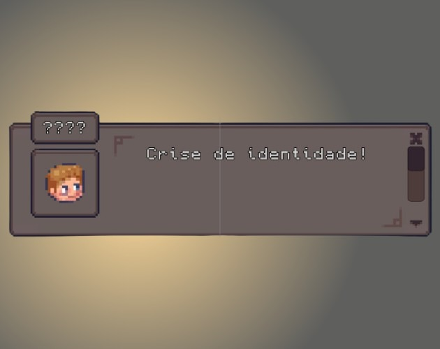

# 🧠 Crise de identidade

**Crise de identidade** é um jogo no estilo *top-down* de puzzle, onde o jogador (personagem) precisa passar por uma série de desafios (inimigos, portas trancadas com senhas, entre outros) para poder recuperar a memória e entender o motivo de estar num hospital abandonado.

---

Para jogar, acesse-o no itch.io: [link](https://rafael-dourado.itch.io/crise-de-identidade)

O arquivo do detonado contendo as resoluções dos *puzzles* em cada nível está na raiz do projeto (Detonado.pdf).

---

**Integrantes e usuário no GitHub**:
- Beatriz Rodrigues de Freitas ([beatrizrodriguesf](https://github.com/beatrizrodriguesf))
- Carlos Eduardo Porciuncula Yamada ([kadu-ymd](https://github.com/kadu-ymd))
- Ellen Coutinho Lião da Silva ([ellencls](https://github.com/ellencoutinho))
- Rafael Dourado Bastos de Oliveira ([rafaeldbo](https://github.com/rafaeldbo))

---

**Referências**:

Música e sons
- freesound_community da Pixabay
- YouTube
  - [Música de fundo](https://youtu.be/EHXl7K8eLoc?si=c5P3Mfl__odzN3hY) por Power Music Factory
  - [Homem dizendo "hum" para indicar pensamento](https://youtu.be/EHXl7K8eLoc?si=c5P3Mfl__odzN3hY)
- [Chiado para simular ansiedade](https://www.zapsplat.com/music/tinnitus-high-pitched-ringing-in-ear/) por ZapsPlat
- [Coração acelerado para simular ansiedade](https://www.soundjay.com/heartbeat-sound-effect.html) por SoundJay ()
- [Som da folha ao passar página no livro](https://pixabay.com/sound-effects/flipping-through-a-bookmp3-14415/) por Zeinel
- [Clique para botão](https://pixabay.com/sound-effects/flipping-through-a-bookmp3-14415/) por freesoundeffects

Sprites
- [Modern Interiors - RPG Tileset](https://limezu.itch.io/moderninteriors) por LimeZu
- [Modern User Interface - RPG asset pack](https://limezu.itch.io/modernuserinterface) por LimeZu